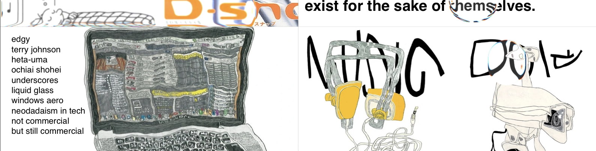

# openGIRAÊ



This is the source code for Giraê, a gacha game for chat platforms.
This is the rewrite of the original version, announced as the Kitsch project. The new version changes the visual identity and clears up the codebase by using a more resilient worker system and typings everywhere.
Inconsistencies across executions have been remediated by enforcing a DBOS workflow-based system for mission-critical logic, while keeping the app scalable and clean.

## Architecture

Giraê is supposed to be highly modular and easy to scale. The legacy version had a rudimentary version of this, but the fact that it kept a lot of state made it hard to scale. This time, DBOS and BullMQ are used all throughout the app to enforce a worker system while keeping consistency across executions.

A view of the execution flow can be seen at flow.mermaid. In a simplified way, the event flow goes like this:
```
telegram/discord -> inbounder --bullMQ-> commandeer --bullMQ-> answerer -> telegram/discord
```


## Packages

- `@girae/common` - Shared constants, utilities, and types for all other workers. Exports BullMQ queues used across workers.
- `@girae/database` - Database access layer, using Drizzle and DBOS Drizzle Datasource.
- `@girae/inbounder` - Receives incoming events from platforms (currently Telegram and Discord), checks if they are valid, and routes them to the `commandeer`.
- `@girae/commandeer` - Implements the command engine, and pushes results back to the `answerer` queue.
- `@girae/answerer` - Sends answers back to platforms with the appropriate formatting and rate limiting.

